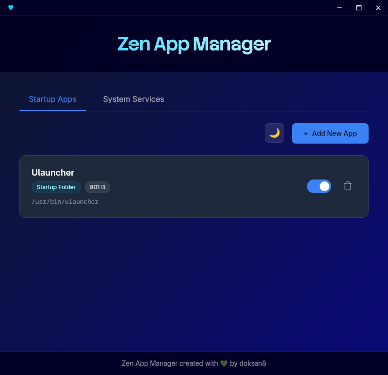

# Zen App Manager

<p align="center">
  
</p>

<p align="center">
  <b>A minimal, modern, and efficient startup application manager.</b>
</p>

<p align="center">
  <a href="#features">Features</a> •
  <a href="#installation">Installation</a> •
  <a href="#screenshots">Screenshots</a> •
  <a href="#license">License</a>
</p>

---

**Zen App Manager** gives you full control over which applications start automatically when you log in. Built with Tauri and Rust, it offers a lightweight, fast, and aesthetically pleasing experience with a focus on simplicity and performance.

## Features

*   **Manage Startup Apps:** Easily list, enable, or disable startup applications.
*   **Add Custom Apps:** Add any command or application to your startup list with a simple interface.
*   **Clean & Safe:** Remove unwanted entries safely.
*   **Modern UI:** A sleek, dark-themed interface designed for modern desktops.
*   **Blazing Fast:** Built with Rust for minimal resource usage.
*   **Cross-Platform:** Primarily designed for Linux (Flatpak support), with experimental Windows support available.

## Screenshots


*(Screenshot of the application running)*

## Installation

### Linux (Flathub)

Zen App Manager is available on Flathub. You can install it with a single command:

```bash
flatpak install flathub com.zen.zen-app-manager
```

### Windows (Experimental)

Windows support is currently in **beta**. You can build the installer from source:

1.  Ensure you have Rust and Node.js installed.
2.  Run the build command:
    ```bash
    npm run tauri build
    ```
3.  The installer (`.exe`) will be located in `src-tauri/target/release/bundle/nsis/`.

### Building from Source

To build the application manually:

1.  Clone the repository:
    ```bash
    git clone https://github.com/installKnox/zen-app-manager.git
    cd zen-app-manager
    ```

2.  Install dependencies and build:
    ```bash
    npm install
    npm run tauri build
    ```

## Contributing

Contributions are welcome! Feel free to open an issue or submit a pull request.

## License

This project is licensed under the MIT License. See the [LICENSE](LICENSE) file for details.
